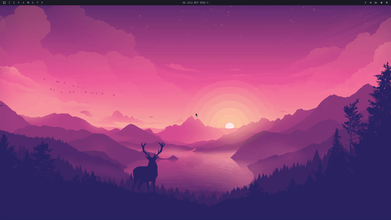
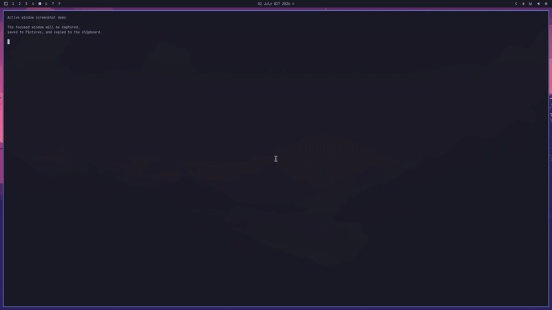

# Omarchy Scripts

Personal scripts for [Omarchy](https://omarchy.org/) and [Hyprland](https://hypr.land/). Commands live in `src/`, keybindings live in `src/manifest.tsv`, and installation generates the managed keybinding block in `~/.config/hypr/bindings.conf`.

## Installation

Clone the repository, enter the directory, and run the installer:

```bash
git clone git@github.com:MarlonPassos-git/omarchy-scripts.git ~/projects/omarchy-scripts
cd ~/projects/omarchy-scripts
./scripts/install
```

## Uninstall

Run the uninstaller:

```bash
cd ~/projects/omarchy-scripts
./scripts/uninstall
```

## Commands

| Title | Description | Shortcut | Script | Dependencies | Evidence |
| --- | --- | --- | --- | --- | --- |
| Active window screenshot | Captures the active window, saves it to Pictures, copies it to the clipboard, opens a preview, and shows a notification with the saved path. | `Super+Shift+Print` | [omarchy-capture-active-window](src/omarchy-capture-active-window) | [hyprctl](https://wiki.hypr.land/Configuring/Using-hyprctl/), [jq](https://jqlang.org/), [grim](https://man.archlinux.org/man/grim.1.en), [wl-copy](https://man.archlinux.org/man/wl-copy.1.en), [imv](https://sr.ht/~exec64/imv/), [xdg-open](https://man.archlinux.org/man/xdg-open.1), [notify-send](https://man.archlinux.org/man/notify-send.1.en) |  |
| Main + side stack layout | Toggles the current workspace between `dwindle` and `master`, using the focused window as the main pane and stacking the other windows on the right. | `Super+Alt+L` | [omarchy-layout-main-two-stack](src/omarchy-layout-main-two-stack) | [hyprctl](https://wiki.hypr.land/Configuring/Using-hyprctl/), [jq](https://jqlang.org/), [notify-send](https://man.archlinux.org/man/notify-send.1.en) |  |

## License

[MIT](LICENSE)
