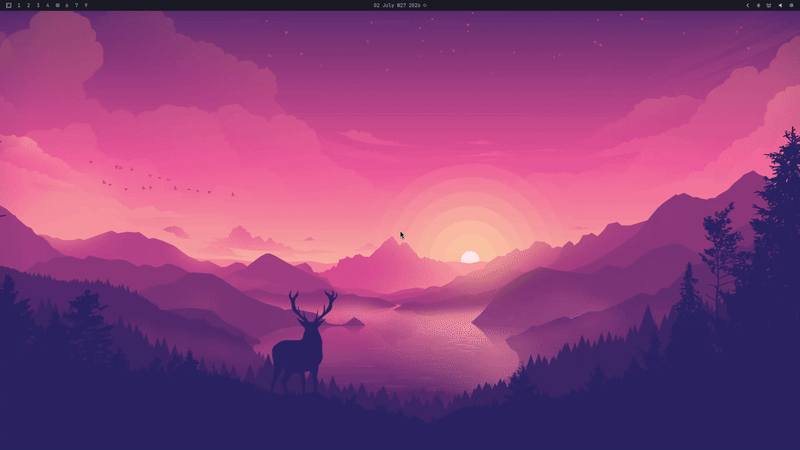
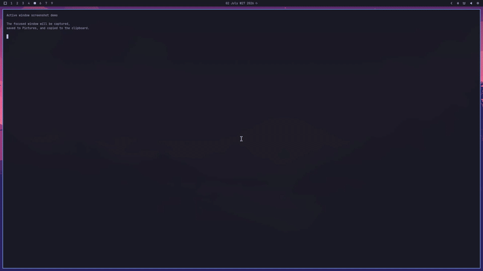

# Omarchy Scripts

Personal scripts and configurations for [Omarchy](https://omarchy.org/) and
[Hyprland](https://hypr.land/). Commands live in `src/`, keybindings live in
`src/manifest.tsv`, and installation generates only project-owned configuration.

## Installation

Clone the repository, enter the directory, and run the installer:

```bash
git clone git@github.com:MarlonPassos-git/omarchy-scripts.git ~/projects/omarchy-scripts
cd ~/projects/omarchy-scripts
./scripts/install
```

The installer activates the managed keybindings and personal Alacritty
configuration described below.

## Uninstall

Run the uninstaller:

```bash
cd ~/projects/omarchy-scripts
./scripts/uninstall
```

The uninstaller removes project-managed keybindings and Alacritty symlinks. The
now-missing Alacritty import remains harmless and is reused by the next install.

## Alacritty configurations

Personal configurations installed without replacing Omarchy's main Alacritty
configuration:

- `Ctrl+Shift+O` highlights URLs and local file paths printed in the terminal.
- Files open in a new Alacritty window with Neovim; directories and other links
  open through the desktop's default handler.
- `file://` URLs, surrounding delimiters, and trailing sentence punctuation are
  normalized before a path is opened.
- Missing paths produce a desktop notification instead of opening an empty editor.
- Alacritty activation requests are prevented from stealing focus in Hyprland.

The installer links the
[Alacritty fragment](config/alacritty/omarchy-scripts.toml) at
`~/.config/alacritty/omarchy-scripts.toml` and the
[hint command](src/omarchy-open-terminal-hint) at
`~/.local/bin/omarchy-open-terminal-hint`. It adds the fragment to
`general.import` once and backs up files before replacing them with links. Edits
in the repository are therefore picked up directly by Alacritty.

## Codex notifications

Connect Codex CLI completion events to Omarchy's desktop notifications:

```bash
./scripts/install-codex-notifications
```

Requires Python 3.11+ and `omarchy notification send`. Restart existing Codex CLI sessions
after installation. The installer points `notify` in `~/.codex/config.toml`
(or `$CODEX_HOME/config.toml`) directly to this clone, preserves unrelated
settings, and creates a timestamped backup before changes. It refuses to replace
another `notify` integration. Rerun it after moving the clone, first removing the
old `notify` setting if it points to the previous location.

Notifications use the desktop theme, the project directory name, and at most
240 characters of the final response. Response text is escaped for notification
markup. The icon uses `codex-desktop` when installed. Delivery does not change focus.
The preview also appears in the desktop notification history.
Clicking a new notification focuses the window that originated it, identified
through its process ancestry rather than its title or project directory. In tmux,
the click also restores the originating session, window, and pane in an attached
terminal. This requires `hyprctl` and, when applicable, `tmux`.
If the window has closed, the tmux client has detached, or several windows share
one terminal PID, the click does nothing rather than selecting an unrelated window.
Old notifications created without a click target cannot acquire one retroactively.
The internal title-generation event observed in Codex CLI 0.153.4 is filtered
by its prompt and response shape so it does not produce a second JSON toast.
This compatibility filter may need updating if Codex changes that internal prompt.

Only completion events are supported by Codex's `notify` integration. The
installer keeps `approval-requested` terminal notifications enabled and removes
completion events from that channel to prevent duplicate Alacritty bell alerts.
The Codex-specific installer does not configure Alacritty's bell or Hyprland
focus rules; those remain independent from the personal configuration above.

To disconnect, remove the top-level `notify` setting and restore your previous
`[tui].notifications` value from the backup, then restart Codex. The general
uninstaller only removes managed keybindings; this opt-in configuration remains.

Validate without sending desktop notifications:

```bash
python3 __tests__/omarchy-codex-notify.integration.spec.py
```

## Commands

| Title | Example | Description | Shortcut | Script | Dependencies |
| --- | --- | --- | --- | --- | --- |
| Codex notifications | - | Shows completion with the project and response preview; clicking returns to the originating terminal or tmux pane. | - | [omarchy-codex-notify](src/omarchy-codex-notify) | Python 3.11+, `omarchy`, `hyprctl`; `tmux` when used |
| Active window screenshot |  | Captures the active window, saves it to Pictures, copies it to the clipboard, and shows a notification with the saved path. | `Super + Shift + Print` | [omarchy-capture-active-window](src/omarchy-capture-active-window) | [hyprctl](https://wiki.hypr.land/Configuring/Using-hyprctl/), [jq](https://jqlang.org/), [grim](https://man.archlinux.org/man/grim.1.en), [wl-copy](https://man.archlinux.org/man/wl-copy.1.en), [notify-send](https://man.archlinux.org/man/notify-send.1.en) |
| Main + side stack layout |  | Toggles the current workspace between `dwindle` and `master`, using the focused window as the main pane and stacking the other windows on the right. | `Super + Alt + L` | [omarchy-layout-main-two-stack](src/omarchy-layout-main-two-stack) | [hyprctl](https://wiki.hypr.land/Configuring/Using-hyprctl/), [jq](https://jqlang.org/), [notify-send](https://man.archlinux.org/man/notify-send.1.en) |
| Alacritty terminal hint | - | Opens terminal file hints in Neovim and delegates directories and links to the desktop. | `Ctrl + Shift + O` | [omarchy-open-terminal-hint](src/omarchy-open-terminal-hint) | Python 3, Alacritty, Neovim, `xdg-open`, `notify-send` |

## License

[MIT](LICENSE)
